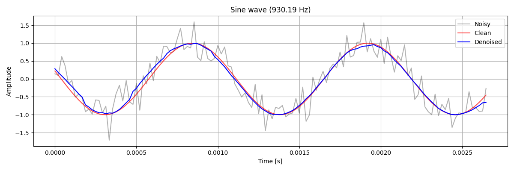

# 🌊 CNN Denoising Autoencoder

  

## 📝 Overview
A real-time signal denoising pipeline built in **PyTorch** using a 1D Convolutional Autoencoder (`nn.Conv1d` / `nn.ConvTranspose1d`). 

The model is trained purely on **synthetic on-the-fly generated signals** sampled at a production-grade rate of **48 kHz**, with chunk-based windowing (128 samples per block) and reconstruction via **Overlap-Add (OLA)** using Hann windowing to prevent boundary artifacts in continuous streaming.

## 🚀 Key Features
- **1D Convolutional Autoencoder**: Symmetrical encoder-decoder architecture that compresses the receptive field to filter high-frequency noise and reconstruct smooth sinusoidal features.
- **Dynamic On-the-Fly Dataset**: Generates endless synthetic training batches with randomized frequencies, initial phases, and Gaussian noise levels (`torch.utils.data.Dataset`), preventing overfitting without saving large files to disk.
- **Real-Time Streaming Ready**: Implements frame-based processing (128 samples, ~2.67 ms latency) with a 50% hop-size **Overlap-Add (OLA)** routine and edge padding/windowing for continuous streams.
- **GPU Accelerated**: Seamless end-to-end execution pipeline supporting both CUDA and CPU inference.

## 🛠️ Tech Stack
- **Language**: `Python 3.10+`
- **Libraries**:
  - `PyTorch` – Deep learning framework and tensor operations
  - `NumPy` – Signal synthesis and vector math
  - `Matplotlib` – Waveform visualization and spectral inspection